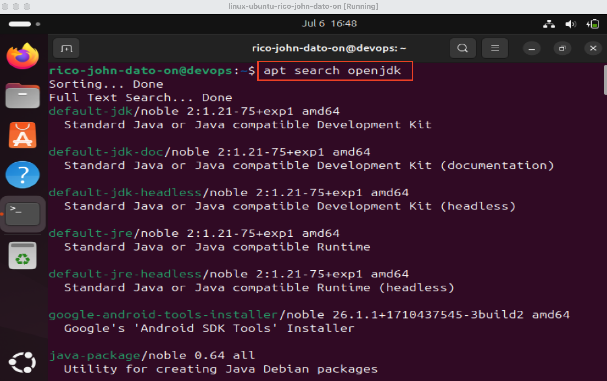
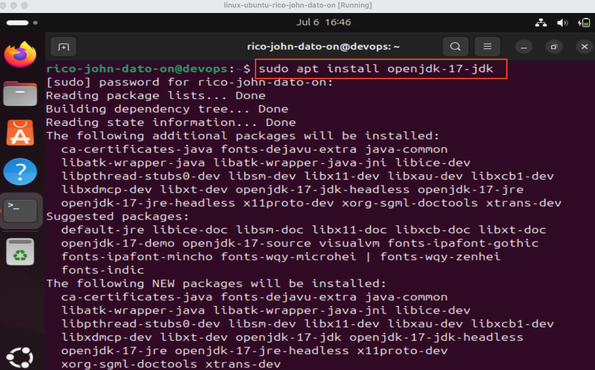
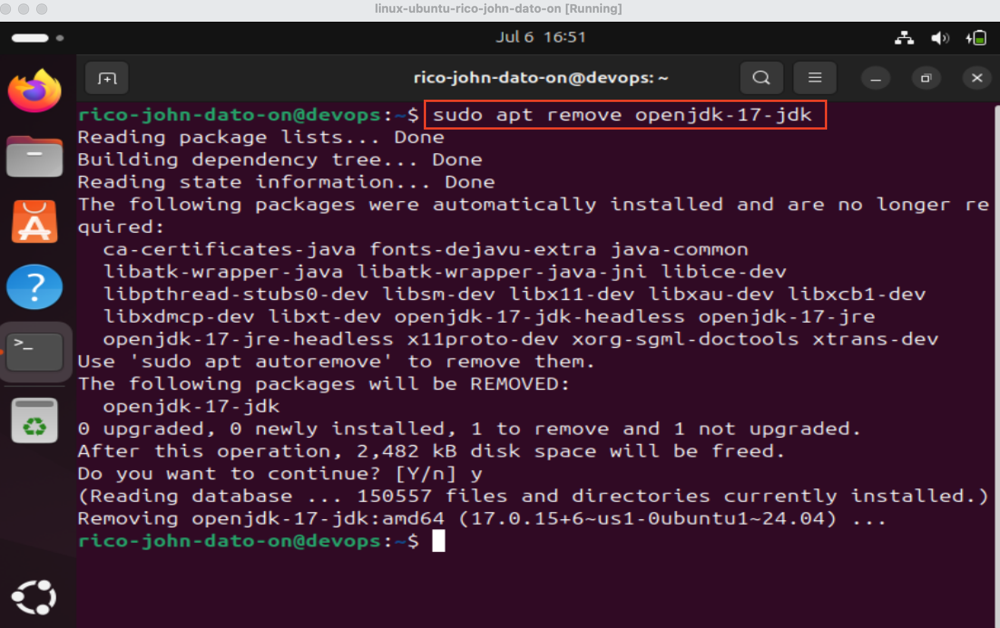

# 📦 Installing Software on Linux with APT

This guide explains how to install, update, and remove software on a Linux system using a **package manager**, specifically `apt` (Advanced Package Tool), commonly used in Debian-based systems like Ubuntu.

---

## 🧠 What is a Package Manager?

A **package manager**:

- Installs software and resolves dependencies
- Keeps track of installed packages
- Removes all components cleanly
- Makes updating software simple

APT is the default package manager in Ubuntu.

---

## 🛠️ Basic APT Commands



### 🔍 Search for a Package

```bash
apt search <package-name>
```

Example:

```bash
apt search openjdk
```

### 📥 Install a Package



```bash
sudo apt install <package-name>
```

Example:

```bash
sudo apt install openjdk-17-jdk
```

---

### ❌ Remove a Package



```bash
sudo apt remove <package-name>
```

Example:

```bash
sudo apt remove openjdk-17-jdk
```

> This removes the package and its dependencies if no longer needed.

---

### ♻️ Update Package List

```bash
sudo apt update
```

---

### ⬆️ Upgrade All Packages

```bash
sudo apt upgrade
```

---

## ✅ Check Software Installation

After installing Java:

```bash
java
java -version
```

To verify it's removed:

```bash
java
# Command not found
```

---

## 💡 Tips

- Use `apt show <package-name>` to view details about a package
- If you know a command but not the package:
  ```bash
  apt-file search <command>
  ```

---

🧑‍💻 \_Created by Rico John Dato-on
